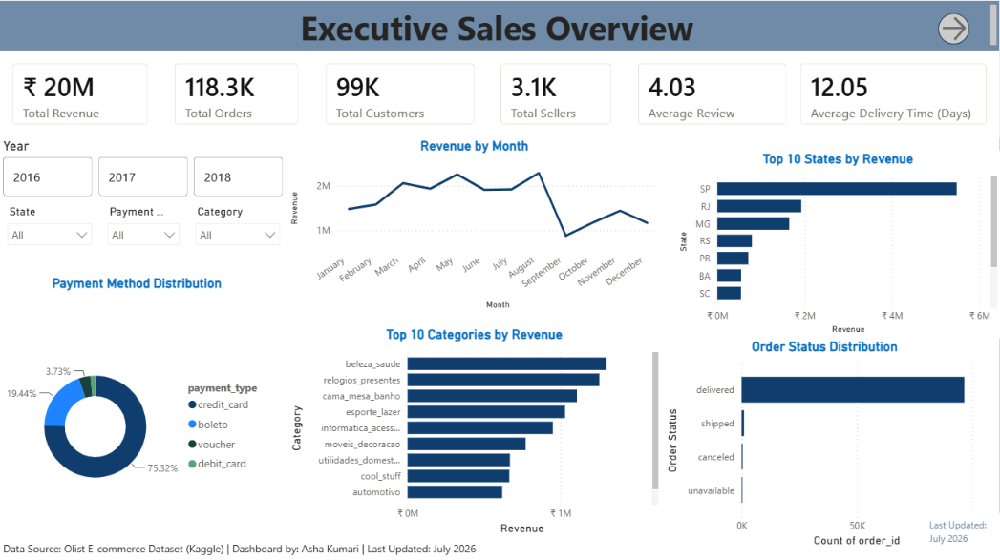
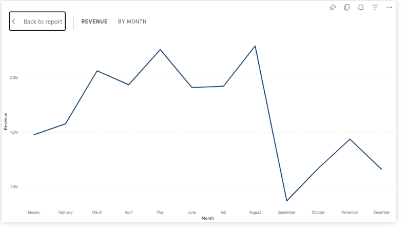
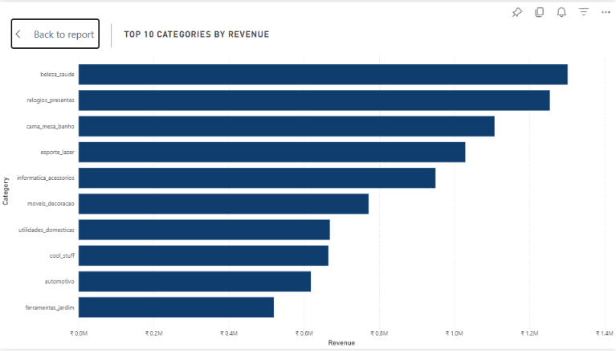
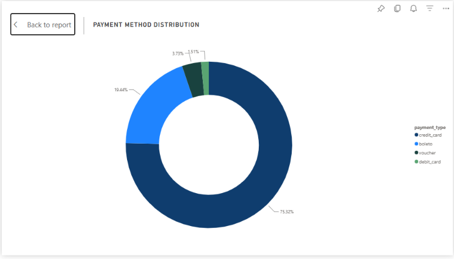
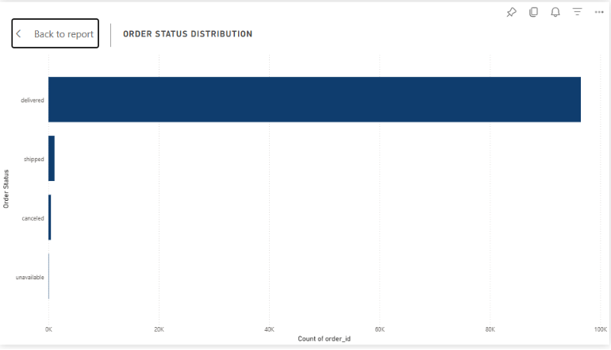
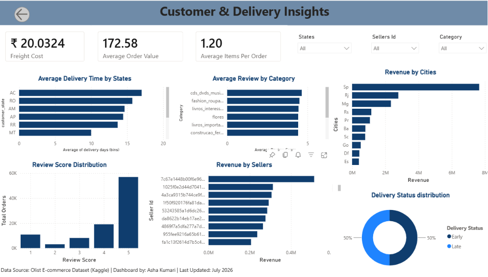
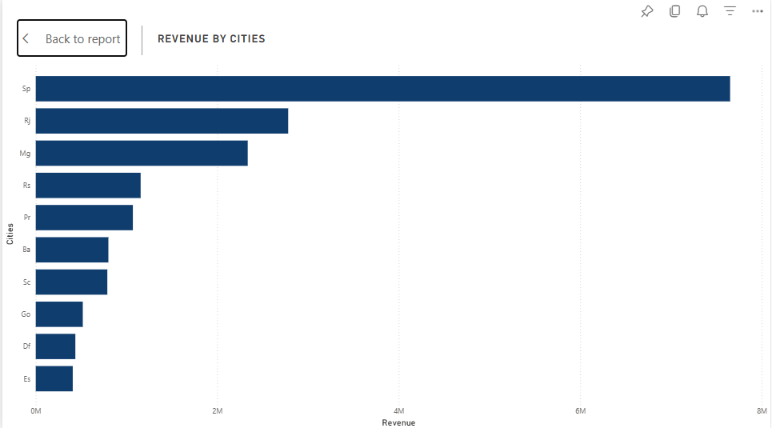
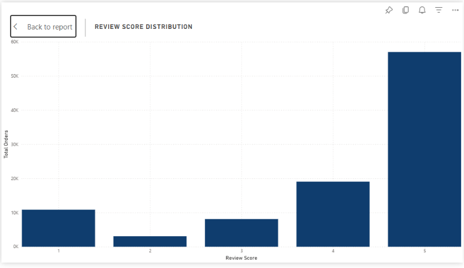

# 📊 Olist E-Commerce Data Analysis

An end-to-end Data Analytics project using the **Olist Brazilian E-Commerce Dataset**. The project demonstrates the complete analytics workflow using **Python, SQL, and Power BI** to generate business insights and recommendations.

---

# 📌 Project Overview

The objective of this project is to analyze customer behavior, sales performance, product performance, delivery efficiency, and customer satisfaction.

The project includes:

- Data Cleaning & Preprocessing (Python)
- Exploratory Data Analysis (EDA)
- SQL Business Analysis
- Interactive Power BI Dashboard
- Business Insights & Recommendations

---

# 🛠️ Tools Used

- Python
- Pandas
- Matplotlib
- MySQL
- Power BI
- Jupyter Notebook

---

# 📂 Project Structure

```text
olist-ecommerce-analysis/

├── notebooks/
│   ├── 01_data_cleaning_and_merging.ipynb
│   └── 02_eda_and_business_insights.ipynb
│
├── sql/
│   └── business_queries.sql
│
├── powerbi/
│   └── Olist_Ecommerce_Dashboard.pbix
│
├── screenshots/
│
├── README.md
└── requirements.txt
```

---

# 📁 Dataset

**Dataset:** Olist Brazilian E-Commerce Public Dataset

The dataset contains information about:

- Customers
- Orders
- Products
- Sellers
- Payments
- Reviews
- Order Items
- Geolocation

> Due to GitHub file size limitations, the cleaned dataset is not included in this repository.

---

# 📊 Dashboard

## 📄 Page 1 – Sales Overview

This page provides an overview of revenue, sales performance, payment methods, and order fulfillment.



### 📌 KPI Cards

**What it shows**

- Total Revenue
- Total Orders
- Total Customers
- Average Review Score

**Why it matters**

Provides a quick overview of the company's overall business performance.


---

### 📈 Monthly Revenue Trend

**What it shows**

Displays monthly revenue trends.

**Why it matters**

Helps identify seasonal demand and peak sales months.



---

### 🛍️ Top Product Categories

**What it shows**

Displays the highest revenue-generating product categories.

**Why it matters**

Helps identify the company's best-performing products.



---

### 💳 Payment Method Distribution

**What it shows**

Displays customer payment preferences.

**Why it matters**

Helps understand customer purchasing behavior.



---

### 📦 Order Status Distribution

**What it shows**

Displays Delivered, Cancelled, Shipped, and Unavailable orders.

**Why it matters**

Helps monitor order fulfillment performance.



---

## 📄 Page 2 – Customer & Delivery Analysis

This page focuses on customer satisfaction and delivery performance.



### 👥 Customer Distribution by City

**What it shows**

Displays cities generating the highest revenue.

**Why it matters**

Helps identify the company's strongest customer markets.



---

### ⭐ Review Score Distribution

**What it shows**

Displays customer review scores.

**Why it matters**

Measures customer satisfaction and overall shopping experience.



---

# 💡 Key Insights

- 📈 November recorded the highest monthly revenue.
- 👥 Most customers are located in São Paulo.
- 💳 Credit Card is the most preferred payment method.
- ⭐ Most customers gave 5-star reviews.
- 🚚 Average delivery time is around 12 days.
- 📉 Longer delivery times generally receive lower review scores.
- 🛍️ A small number of product categories generate most of the revenue.

---

# 🎯 Business Recommendations

- Improve delivery speed to increase customer satisfaction.
- Encourage customers to leave reviews.
- Focus marketing on high-performing product categories.
- Expand marketing campaigns beyond São Paulo.
- Increase inventory before peak sales months.

---

# 🚀 Skills Demonstrated

- Data Cleaning
- Data Wrangling
- Exploratory Data Analysis
- SQL
- CTEs
- Window Functions
- Business Analysis
- Data Visualization
- Power BI Dashboard Development
- Python
- MySQL

---

# 📌 Conclusion

This project demonstrates an end-to-end data analytics workflow using **Python, SQL, and Power BI**. The analysis provides insights into sales, customer behavior, delivery performance, and product performance while supporting better business decisions through data-driven recommendations.

---

# 👩‍💻 Author

**Asha Kumari**

- GitHub: https://github.com/asha-droid-a11y
- LinkedIn: www.linkedin.com/in/asha-kumari-analyst2005
